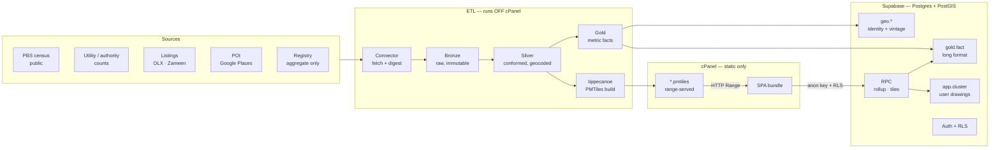

# Urban Intelligence Platform — Architecture

Branch: `feature/urban-intelligence-mapping`.
Status: **design, not built.** Nothing here ingests, serves or deploys yet. The
SQL under `warehouse/schema/` is the proposed schema; the directories under
`app/` and `etl/` are placeholders with their contracts written down.

---

## 1. What changes, and why

Today the map is one Python script that reads a workbook plus a geo JSON and
writes a 1.1 MB self-contained HTML file. That design is correct for what it
does — five cities, fifteen geometry layers, one analyst, one artefact, no
server, no secrets, reproducible in about a second.

It stops working the moment any of the following is true, and the brief asks for
all four:

| Ask | Why the current design cannot carry it |
|---|---|
| Many sources on a refresh cadence | `refresh.py` is a single-shot build. There is no landing zone, no run history, no way to say *when* a figure was fetched or *whether* it superseded an earlier one. |
| Drill to arbitrary depth | Geometry is inlined into the page. Parcel- or listing-level data is 10²–10⁴× the current 936 KB and cannot ship in a bundle. |
| 3D | `d3.geoPath` draws SVG. There is no extrusion, no depth buffer, no GPU path. |
| User-drawn clusters | Aggregating an arbitrary polygon needs a spatial engine. The browser has the geometry but not the index, and the apportionment maths must be auditable. |

The new architecture keeps every invariant the current model earned the hard way
— provenance on every figure, no fabricated boundary, a caveat travelling beside
its number — and moves them from convention into schema constraints.

**The current map is not deleted.** It stays on `main` and keeps serving until
the new app reaches parity. `refresh.py`'s outputs are the *first* load into the
warehouse (§9).

---

## 2. Shape of the system



Three deployment surfaces, and the split is forced by cPanel:

- **cPanel serves bytes and nothing else.** The SPA bundle and the PMTiles
  archives. No PHP, no Node process, no cron of consequence. See
  [DEPLOYMENT_CPANEL.md](DEPLOYMENT_CPANEL.md).
- **Supabase is the database and the API.** PostgREST over the schema, Auth,
  RLS, and a small number of `plpgsql` functions for the things SQL-over-HTTP
  cannot express (tile encoding, polygon apportionment).
- **ETL runs somewhere with a real CPU** — GitHub Actions on a schedule, or a
  workstation, or a cheap VPS. Never on cPanel. `tippecanoe`, `shapely` and
  GDAL do not install on shared hosting, and a long build is killed by the CPU
  governor before it finishes.

---

## 3. The hard part: geographic identity

Everything else is plumbing. This is the part that decides whether the platform
survives its second year.

This repo has already been bitten twice, and both bites are the same bite:

- Lahore went from **5 tehsils to 10** on 27 Aug 2024. Joining 2023 census
  figures to the 2024 outlines left **59% of Lahore undrawn**, because only five
  of the ten names collide and a same-named 2024 outline is a *fraction* of its
  census parent (post-2024 Shalimar is 23 km² against 272 km², −91%).
- Karachi's municipal tier is the **Town**; the census publishes a parallel
  *taluka* layer that does not align with it. Neither is wrong. They are
  different partitions of the same ground.

A schema that models geography as one tree with one set of names reproduces both
bugs forever. So geography is modelled as **identified units with a validity
window, plus explicit crosswalks between vintages, plus a containment table
computed from the geometry rather than asserted from names.**

### 3.1 Unit

`geo.unit` — one row per (place, level, vintage). The primary key is a
deterministic string, not a serial, so an ETL rerun is idempotent and a git diff
of the seed is readable:

```
PK.SD.KHI.DIST.SOUTH            Karachi South district
PK.PB.LHE.TEHC.SHALIMAR@2023    Shalimar, census vintage
PK.PB.LHE.TEHN.SHALIMAR@2024    Shalimar, 2024 notification vintage — a different shape
```

Every unit carries `accuracy` in `{official, derived, approximate}` and an
`accuracy_note`. This is invariant 8 of the existing model (*several geometries
are approximate; never present a derived shape as authoritative*) turned into a
`NOT NULL` column. The Lahore derived tehsils, the crosswalked Karachi district
polygons and the Voronoi localities can all enter the warehouse — they simply
cannot enter it silently.

### 3.2 Vintage and crosswalk

`valid_from` / `valid_to` on the unit; `geo.crosswalk` carries the weighted
mapping between vintages, with the `basis` recorded (`area`, `households`,
`population`, `exact`). Weights per source unit sum to 1, checked by
`geo.v_crosswalk_check` — the same shape of guard as the existing model's
"Fee Units sum to 100".

Consequence: the 2024 Lahore notification becomes a *first-class vintage* rather
than a shapes-only dead level. A 2023 census figure can be apportioned onto the
2024 tehsils, labelled as apportioned, with the basis stated.

### 3.3 Containment, computed not asserted

`geo.containment(child_id, ancestor_id, depth, coverage)` is materialised from
the geometry: `coverage` is the fraction of the child's area inside the ancestor.
Clean nesting gives 1.0. Karachi towns against census talukas give a spray of
partials — which is the truth, and now it is *queryable* truth. Drill-down reads
this table, so a user can descend from a census taluka into towns that only
partly sit inside it and see exactly how much of each is in scope.

### 3.4 H3 as the vintage-free fallback

Point sources (listings, POIs) are indexed to H3 resolution 8 and 9 at silver
time as well as being snapped to an admin unit. Admin boundaries get redrawn;
H3 cells do not. Hexes also give the privacy primitive: a cell with fewer than
`k` underlying records is suppressed rather than published (§5.3).

H3 indices are computed in Python during ETL and stored as `text`. No `h3-pg`
extension is required, which matters — hosted Supabase does not carry it.

---

## 4. Warehouse: bronze to silver to gold

Three layers, each with one job.

### Bronze — `bronze.record`

Raw payload exactly as fetched, `jsonb`, never edited, never deleted except by
retention policy. Carries `run_id`, `fetched_at`, the source's own
`natural_key`, and `expires_at`.

`expires_at` is not housekeeping. It is how a source's caching terms are
*enforced* rather than remembered: a source whose licence permits a 30-day cache
lands with `expires_at = fetched_at + 30 days` and `bronze.purge_expired()`
removes it. See [DATA_SOURCES.md](DATA_SOURCES.md).

Reprocessing silver from bronze must be deterministic. Every run records the
`input_digest` (sha256 of the raw payload) and `code_version` (git sha), so any
gold figure traces to the exact bytes and the exact code that produced it.

### Silver — `silver.observation`

One conformed row per (source, entity, observation date): geocoded, snapped to
`geo_id` **as of the observation date**, H3-indexed, deduplicated on
`(source_id, natural_key, observed_at)`, with a `quality` score for geocode
confidence. Attributes stay in `jsonb` — source schemas change without warning
and a listings site is not going to file a migration ticket.

### Gold — `gold.metric` + `gold.fact`

Long format, one row per `(geo_id, metric_id, period)`.

This is the scalability decision that matters most day to day. A wide table
needs a migration for every new indicator; long format needs an `INSERT`. Adding
"median asking price per sq ft, monthly" is one row in `gold.metric` and a load
into `gold.fact`. The nine census layers in the current map, the household
projections, listing prices, POI density and any internal sales figure all live
in the same two tables — and the frontend's layer registry becomes *data*
instead of code.

`gold.metric.sensitivity` in `{public, internal, commercial}` is the access
control seam, and it retires a workaround: `refresh.py` currently ends with a
`FORBIDDEN` key check that fails the build if a commercial figure reaches the
static HTML, because a static file cannot keep a secret. Under RLS the check is
structural — an unauthorised client cannot select a `commercial` metric, and
there is no bundle for it to leak into.

---

## 5. Sources and the legal gate

Full treatment in [DATA_SOURCES.md](DATA_SOURCES.md). Two points belong here
because they are architectural, not editorial.

### 5.1 `src.source.enabled` defaults to false

No connector runs until a row exists in `src.source` with a `legal_basis` and a
`license_ref`, and someone sets `enabled = true`. The registry
(`warehouse/sources/registry.yml`) is the reviewable artefact; the table is the
enforcement point. This is deliberate friction on exactly the sources in the
brief that are not straightforwardly public.

Three of the named sources need that gate:

- **NADRA** does not provide bulk citizen or household data, and it is not
  something to design around. What *is* obtainable and genuinely useful is
  aggregate: NADRA's own published statistics, and the ECP's electoral-roll
  counts by block code — public, aggregate, and joinable to census block
  geography. The schema treats that as `kind='registry'`, `pii_class='none'`,
  `min_geography='block'`. Household-level registry data stays out of scope
  until a lawful basis exists, and the `enabled` flag is where that decision
  gets recorded.
- **OLX and Zameen** publish no bulk API and their terms prohibit scraping. The
  defensible routes are a licensed feed or a data partnership; Zameen's
  published aggregate market index is usable today. The connector interface is
  identical either way, so a source moves from "index only" to "licensed feed"
  without touching silver or gold.
- **Google Places** permits only limited caching. Modelled as a short
  `expires_at` on bronze plus derived aggregates in gold that survive the purge.

None of this blocks the build. Census, authority approvals, utility connection
counts and the existing model outputs are enough to stand the platform up, and
the gated sources slot in behind an interface that already exists.

### 5.2 Provenance is not optional

Every gold fact carries `run_id`. Every run carries `source_id`, digest and code
version. The existing CSV export already refuses to separate a figure from its
boundary-accuracy caveat; here that is the default for everything.

### 5.3 Suppression

`gold.metric.k_threshold` and `min_geography` are enforced in the read path, not
by convention. A metric derived from individual records is not returned below
its minimum geography, and a cell with `n < k` returns `null` with a reason
rather than a number.

---

## 6. Serving geometry: PMTiles for the base, MVT for the live

Two different problems, two different answers.

**Base geometry is large, changes rarely, and is identical for every user.**
Build it once in ETL with `tippecanoe`, into a PMTiles archive per city.
PMTiles is a single file addressed by HTTP Range request — no tile server, no
per-tile function call, and it works on plain static hosting, which is precisely
what cPanel is. The client registers the `pmtiles://` protocol on MapLibre and
reads ranges directly.

Each tiled feature carries `geo_id` and nothing else of substance. **Attributes
do not go in the tiles.** They arrive from Supabase as a compact
`{geo_id: value}` map for the current metric, period and viewport, and the
client joins them on the fly via `setFeatureState` or a deck.gl accessor. Three
things fall out of that split:

1. Changing a metric or a year is a small JSON fetch, not a tile rebuild.
2. Commercial metrics are never baked into a public file.
3. Geometry caches hard and forever (content-hashed filename); attributes cache
   briefly.

**User-drawn and per-org geometry is small, changes constantly, and differs per
user.** That goes through `api.tile(z,x,y,layer)` — `ST_AsMVT` over
`app.cluster`, behind RLS, so a drawn cluster is visible only to its org.

The basemap itself is a **Protomaps basemap PMTiles built from OSM**, self-hosted
beside the app. No API key, no third-party request, no vendor rate limit, and no
external service learning which territories are being examined — which, given
the commercial sensitivity noted in `CLAUDE.md`, is worth the disk.

---

## 7. Frontend

**Vite + React + TypeScript.** MapLibre GL JS for the map, deck.gl overlaid via
`MapboxOverlay` in interleaved mode so extruded data layers sort correctly
against basemap buildings and terrain.

| Concern | Choice | Why |
|---|---|---|
| Map engine | MapLibre GL JS | BSD, no token, vector tiles, `fill-extrusion`, terrain |
| Data layers | deck.gl | GPU-scale polygons and points, H3 layer built in, extrusion |
| Drawing | terra-draw | MIT, MapLibre-native adapter, polygon + freehand |
| Server state | TanStack Query | request dedupe, cache keyed on (metric, period, level, bbox) |
| Client state | Zustand | small, and the map instance stays outside React |
| Shareable state | **the URL** | see below |
| Tables and charts | TanStack Table + Observable Plot | Plot is d3-native, so existing chart logic ports |

### 7.1 State lives in the URL

The current app persists a few toggles to `localStorage`. That does not survive
the thing a dashboard is actually for: sending someone a view. City, level,
metric, period, 3D on/off, selected units and active cluster all serialise into
the query string; `localStorage` keeps only per-user conveniences (panel
collapse, label density). A link reproduces a view exactly.

### 7.2 Drill

Drill is a query against `geo.containment`, not a hardcoded ladder. The current
`LEVELS` map — Karachi districts to towns to neighbourhoods, Lahore's two tehsil
vintages, Islamabad's un-splittable whole — becomes rows. A new city is a data
load. Selecting a unit and dropping a level filters children by
`coverage > threshold` and reports partial containment instead of hiding it.

### 7.3 3D, with a caveat stated up front

Extrusion height binds to any metric: `fill-extrusion-height` for the MapLibre
path, deck.gl `PolygonLayer({extruded:true})` for the heavy path, plus
`H3HexagonLayer` for point-derived aggregates and optional terrain from a
terrain-RGB PMTiles.

The caveat: **an extruded choropleth is a worse chart than a flat one.** Tall
polygons occlude short ones, perspective foreshortens the back of the scene, and
height is read less accurately than colour. It earns its place where the third
dimension carries real meaning — households per km², pump points, a price
surface — and for showing an audience a skyline they can navigate. It is a
presentation mode, not the analysis mode, so 3D is a toggle on a 2D-default map
and the legend states the height metric and its scale. The existing choropleth
guard (flat shading where the spread is under 5%, with the spread stated)
carries over and applies to height as well as colour.

### 7.4 Draw a cluster, get the numbers

1. Draw a polygon, or lasso-select existing units.
2. `POST` the geometry to `api.rollup_polygon(geom, level, metrics, period, basis)`.
3. Postgres intersects it with `geo.unit` at that level and apportions.

Apportionment is where an analytics tool usually starts lying. Splitting a unit
by **area** assumes uniform density inside it, which is false everywhere and
badly false in Karachi — Bahria Town Karachi is 186 km² at roughly 91 people per
km², and area-weighting it against a dense neighbour would invent tens of
thousands of households. So `basis` defaults to `households` where a household
count exists for the unit (dasymetric weighting) and falls back to `population`,
then `area` — and the function **returns the basis it used and the fraction of
the drawn polygon actually covered by units with data**, alongside every value.
The client renders that beside the number. A cluster spanning ground with no
data reads as partial coverage, not as a small total.

Saved clusters go to `app.cluster` under RLS. A saved selection of whole units
(`kind='selection'`) needs no apportionment at all, which is the recommended way
to define anything contractual — the current dealership scheme is exactly that:
named regions, not drawn shapes.

---

## 8. Security

- **Supabase Auth**, email plus org. The `anon` key ships in the bundle, which is
  safe only because RLS is on for every table without exception — including the
  ones that look harmless.
- **RLS by `org_id`** on `app.*`. Reference data (`geo.*`, `gold.metric`) is
  readable by authenticated users; `gold.fact` is filtered by the metric's
  `sensitivity`.
- **`service_role` never touches the browser.** It exists for the ETL and lives
  in the ETL runner's secret store.
- **Commercial figures leave the client bundle entirely** (§4) — the direct fix
  for the current position, where a price sits inside a 1.1 MB static file and
  the only defence is that the file is not published.

---

## 9. Migration from the current model

The existing artefacts are the seed, not throwaway:

| Existing | Becomes |
|---|---|
| `pakistan_urban_geo.json` — 15 layers | `geo.unit` rows, one level each, `accuracy` per the gotchas already documented |
| `scenario_a.json` `regions` / `cities` | `gold.fact` for population, households, growth, 2023–2030 |
| `dealership_clusters.json` | `app.cluster` (`kind='selection'`) + `app.cluster_member` |
| `Dealership_Model.xlsx` | stays the source of truth for the fee model; publishes `commercial` metrics into gold |
| `LAYERS` in `map_template.html` | `gold.metric` rows |
| `LEVELS` in `map_template.html` | `geo.level` + `geo.containment` |

Phasing:

1. **Schema and seed.** Load the existing geo and census data. The warehouse now
   reproduces today's map's numbers, and the seed is diffed against
   `scenario_a.json` as the acceptance test — same figures, or the load is wrong.
2. **Read path.** PMTiles build, attribute API, app shell with 2D parity.
3. **3D and drawing.** Extrusion, terra-draw, `rollup_polygon`.
4. **First new source.** Whichever clears the legal gate first. Everything up to
   here runs on public census data, so nothing waits on a licence.
5. **Retire the built HTML** once parity is signed off — not before.

Step 1 is the one that must not be rushed. If geographic identity is wrong,
every later step inherits it.

---

## 10. Known constraints, stated plainly

- **cPanel cannot run the ETL.** Not a preference. `tippecanoe` and GDAL do not
  install there and the CPU governor kills long jobs. The ETL runs on GitHub
  Actions (free at this cadence) or any small box.
- **Supabase free tier is 500 MB.** Census-only fits. Listings and POIs at city
  scale do not — budget for Pro. Geometry itself lives in PMTiles on disk, not in
  the database, which keeps the database small for longer.
- **PMTiles need HTTP Range.** Apache and LiteSpeed both support it, but
  compressing `.pmtiles` silently breaks it. Handled in the `.htaccess`
  template; see [DEPLOYMENT_CPANEL.md](DEPLOYMENT_CPANEL.md).
- **Node is not installed on the current workstation.** Node 20+ is a
  prerequisite for the app build. The ETL stays Python, as now.
- **Three of the five named sources are not freely available.** §5.1. The build
  does not depend on them.
- **Apportioning a drawn polygon is an estimate.** Always. The design's answer is
  to state the basis and the coverage every time, never to hide it.

---

## 11. Invariants for the new system

Carried forward from the model, plus what this design adds:

1. **Every published figure resolves to a run, a digest and a code version.**
2. **No unit without an `accuracy`.** Derived and approximate geometry is
   welcome; unlabelled geometry is not.
3. **Crosswalk weights sum to 1** per source unit. Guarded by a view.
4. **A number never travels without its caveat** — coverage, basis, accuracy and
   suppression ride alongside the value through the API, the UI and the export.
5. **No source ingests before `src.source.enabled` is set**, and setting it
   requires a `legal_basis` and a `license_ref`.
6. **RLS on every table.** No exceptions for "reference" data.
7. **Geometry and attributes stay separate.** Attributes never enter a tile.
8. **The URL reproduces the view.**
